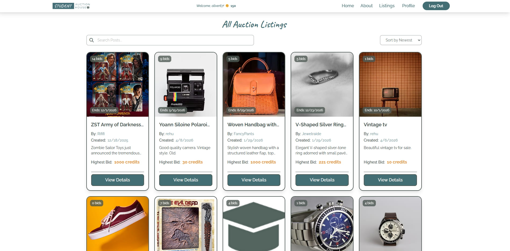

# Semester-Project-2 - Student Auction House
A student-only online auction platform built with HTML, Tailwind CSS, and Vanilla JavaScript using the Noroff Auction API.

This project is a front-end auction web application developed as part of Semester Project 2. The application allows users to register, create listings, and place bids using virtual credits. Visitors can browse and search listings, while full functionality is restricted to authenticated users with a @stud.noroff.no email.

The application integrates with the Noroff Auction API and demonstrates planning, design, and development of a dynamic and interactive solution.

## FEATURES

### Authentication
- **Register with @stud.noroff.no email**
- **Secure login and logout**
- **Store user session in localStorage**

### Listings
- **View all listings (public access)**
- **View individual listing details**
- **Create new listings (authenticated users)**
- **Edit and delete own listings**

### Bidding
- **Place bids on listings**
- **View bid history on each listing**
- **Prevent bidding on own listings**
- **Dynamic credit updates after bidding**

### Search & Filtering
- **Search listings by keywords**
- **Sort listings using dropdown options**

### Profile
- **View user profile**
- **See created listings**
- **See bids made**
- **View available credits**

## TECH STACK

- **JavaScript (ES6 Modules)**
- **HTML5**
- **Tailwind CSS (CLI)**
- **Noroff Auction API**
- **Deployment** – Netlify

## GETTING STARTED

### Clone the repo:

git clone https://github.com/camiP89/Semester-Project-2.git

### Install dependencies:

npm install

### Run locally:

npm run dev

### Build for production

npm run build

## LINKS

- **Live Site:** [https://studentauctionhouse.netlify.app/](https://studentauctionhouse.netlify.app/)

- **GitHub Repository:** [https://github.com/camiP89/Semester-Project-2.git](https://github.com/camiP89/Semester-Project-2.git)

- **Project management**
A GitHub Projects board was used to plan and manage the project. Tasks were organised into epics such as authentication, listings, bidding and profile management, with issues, sizes and deadlines assigned to support structured development.

 [https://github.com/users/camiP89/projects/16](https://github.com/users/camiP89/projects/16)

 - **Design**
 The design system and prototypes were created in Figma, including:
 - **Style guide (colours, typography)**
 - **UI components**
 - **Responsive layouts (mobile and desktop)**

  [https://www.figma.com/design/hw4HgCVqaHndypQ67KWX3U/Semester-Project-2?node-id=0-1&t=Xd4JNLoaEShfvly1-1](https://www.figma.com/design/hw4HgCVqaHndypQ67KWX3U/Semester-Project-2?node-id=0-1&t=Xd4JNLoaEShfvly1-1)

## Testing
Manual testing was conducted for all user stories to ensure the application met the project requirements and functioned correctly across different user scenarios, including:

- **Visitor functionality**
- **Authentication flows**
- **Listing creation and updates**
- **Bidding system and credit updates**

## Reflection

This project improved my understanding of API integration, asynchronous JavaScript and also strengthened my ability to plan and structure a full front-end application using a Kanban workflow and design system.

## Contact

Email: campug04041@stud.noroff.no

## Acknowledgements
- **Noroff Vocational College**
- **Course teacher - Nelly Moseki**
- **Noroff Auction API**

